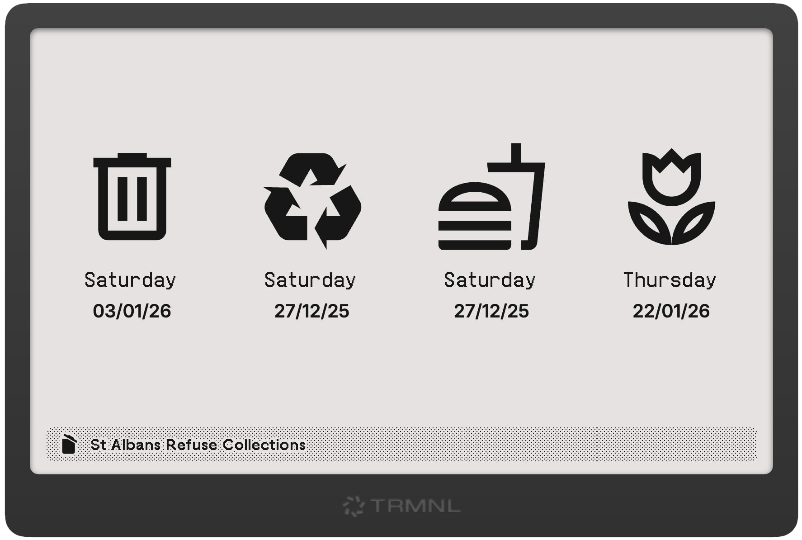

# TRMNL St Albans Refuse Collection

A port of [my Home Assistant refuse collections plugin](github.com/jshiell/homeassistant-stalbansrubbishcollections/) for St Albans to [TRMNL](https://usetrmnl.com).



## Running Locally

You'll need Ruby to run [trmnl-preview](https://github.com/usetrmnl/trmnlp).

```bash
gem install trmnl-preview
```

UPRN=<your UPRN here> trmnlp serve
```

You can get [your property's UPRN here](https://www.findmyaddress.co.uk) if you don't have it.
